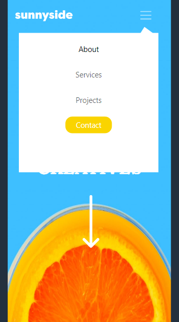

# Frontend Mentor - Sunnyside agency landing page solution

This is a solution to the [Sunnyside agency landing page challenge on Frontend Mentor](https://www.frontendmentor.io/challenges/sunnyside-agency-landing-page-7yVs3B6ef). Frontend Mentor challenges help you improve your coding skills by building realistic projects.

## Table of contents

- [Overview](#overview)
  - [The challenge](#the-challenge)
  - [Screenshot](#screenshot)
  - [Links](#links)
- [My process](#my-process)
  - [Built with](#built-with)
  - [What I learned](#what-i-learned)
  - [Continued development](#continued-development)
  - [Useful resources](#useful-resources)
- [Author](#author)

## Overview

### The challenge

Users should be able to:

- View the optimal layout for the site depending on their device's screen size
- See hover states for all interactive elements on the page

### Screenshot

### Screenshot



### Links

- Solution URL: [Github](https://github.com/cmb347827/sunnyside-agency-landing-page-main)
- Live Site URL: [Live Github](https://cmb347827.github.io/sunnyside-agency-landing-page-main/)

## My process

### Built with

- Semantic HTML5 markup
- Sass/SCSS
- Bootstrap
- jQuery/Javascript
- Mobile-first workflow


### What I learned
- I had some layout problems due to the simple fact I was using 
     ```
	    display:grid; display grid;
        place-contents:center;
     ```
  instead of margin to center the layout in mobile. These are little subtleties that are still hard to understand for me. Also, using grid caused child elements to be wider.
- I also thought I had some layout problems with section with images, until I realized I had set its url background dimensions to 50% 100% instead of 100% 100%.
- I never knew that image transformations still means an image takes up it's original size in layout , even though the image size has changed. I Added height to outer divs to deal with this. 
- I only used Bootstrap for the menu dropdown this time. I had some trouble with positioning of the menu dropdown at first. I experimented with JS first, just for practice, but noticed that the button would jump positions using just JS, so I switched to SCSS, which makes more design sense anyway. 

### Continued development

- Daily tutorials and projects in HTML5, CSS3, Javascript, Bootstrap, Sass/SCSS. For now, in time I will go re-learn React ect.

### Useful resources


## Author

- Website - [One of my latest codepens](https://codepen.io/cynthiab72/pen/oNybYON)
- Frontend Mentor - [@cmb347827](https://www.frontendmentor.io/profile/cmb347827)

